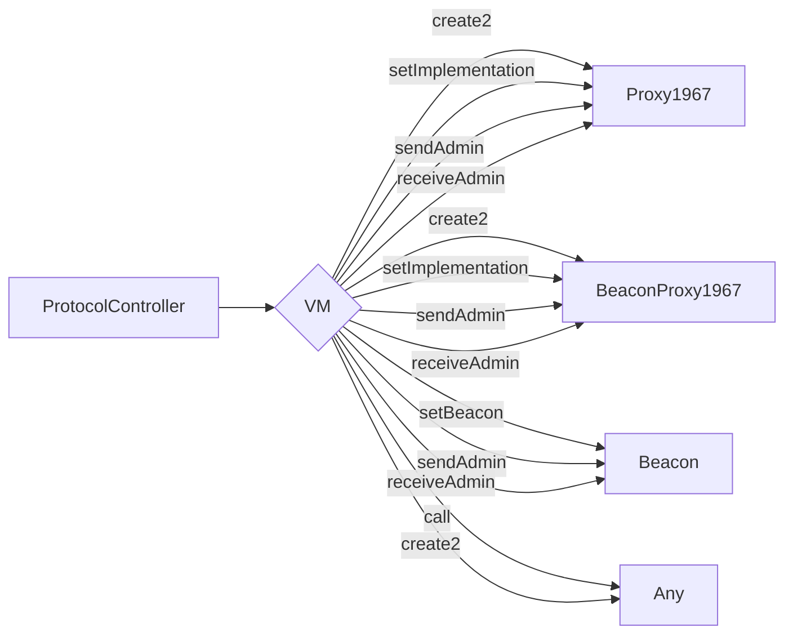
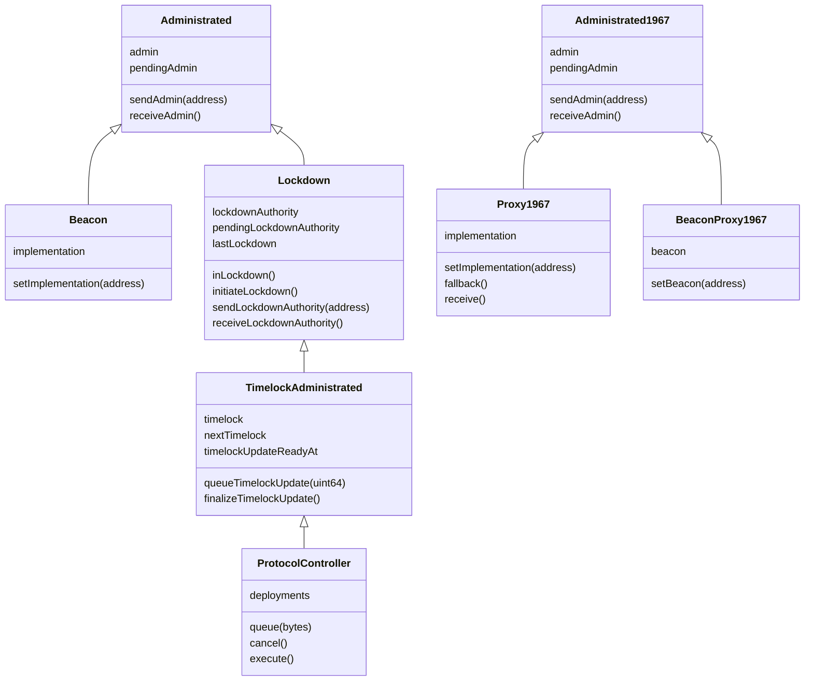
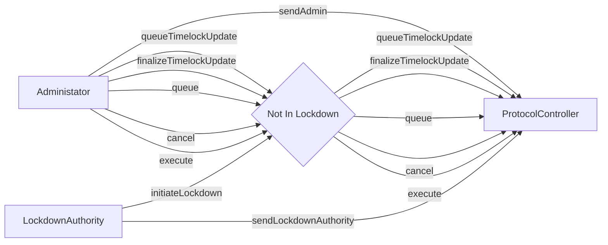

# Protocol Controller

The `protoctl` system enables complex smart contract deployment and upgrades with a publicly visible
timelock. Queued deployment data is stored for easy access in analyzing and auditing the deployment.

## Architecture

We employ a virtual machine whose intructions enshrine create and update operations for ERC-1967
beacons and proxies, administrator changes to target contracts, arbitrary external calls, and
arbitrary deterministic contract creations.

```solidity
enum Opcode {
    Halt,
    CreateProxy,
    CreateBeaconProxy,
    SetImplementation,
    SetBeacon,
    SendAdmin,
    ReceiveAdmin,
    Call,
    Create2
}
```



Each opcode comes with associated data tightly packed to their upper byte boundary. This is
functionally comparable to `abi.encodePacked`. The data associated with each is as follows.

```ebnf
operation ::=
    | (<halt>)
    | (<createProxy> . <salt>)
    | (<createBeaconProxy> . <salt>)
    | (<setImplementation> . <proxy> . <impl>)
    | (<setBeacon> . <proxy> . <beacon>)
    | (<sendAdmin> . <proxy> . <admin>)
    | (<receiveAdmin> . <proxy>)
    | (<call> . <target> . <value> . <payload>)
    | (<create2> . <salt> . <initcode>);

deployment ::= operation+
```

## Class Inheritance Tree

The `Administrated` inheritance tree uses the standard Solidity storage layout.

The `Administrated1967` inheritance tree uses the ERC-1967 compliant storage layout to avoid
storage collisions.



## Threat Modelling

Two authority addresses control the system with different levels of control, Administrator and
Lockdown Authority.



### Administrator

The Administrator has the authority to take any privileged action in the system except initiate
lockdown (more on this in [Security Council](#security-council)). The administrator may:

- Transfer Administrator authority to any other address.
- Queue a timelock update.
- Finalize a timelock update.
- Queue a deployment.
- Cancel a deployment.
- Execute a deployment.

#### Timelock

All privileged actions aside from transferring the Administrator authority are timelocked. All
actions must await at least the duration of the timelock, including timelock updates themselves.
This prevents the Administrator from forcing through any significant action without a timelock delay
in which constituents may audit and optionally exit the system.

All significant actions are logged, enabling contituents to receive advanced notice for audit and
exit. All deployments are stored on-chain such that constituents may query and parse the deployment
data using client software, and take action as they see fit.

### Lockdown Authority

The Lockdown Authority functions as a security council with only the authority to delay, not
indefinitely halt or veto all significant actions. The Lockdown Authority may:

- Initiate lockdown.
- Transfer Lockdown Authority to any other address.

#### Lockdown

Under lockdown, all significant actions by the Adminstrator are halted except the transfer of the
Adminstrator authority. No timelocked action may be initiated and timelocked actions can only be
finalized after either the timelock has passed or the lockdown has expired, whichever is longest.

### Protocol Controller

The Protocol Controller has the authority to make arbitrary contract calls and contract deployments.
The design of the Protocol Controller is to delegate all upgrade and permissioned code paths in a
given system to it. This reduces the attack surface of the entire system to the protocol controller,
which can only take significant action based on the Administrator's inputs after a timelock and a
Lockdown Authority's lockdown, if any.

### Malicious Compromise

A malicious compromise refers to an authority taking any action to harm constituents, be it the
result of a breach or malicious intent of the authority. The following subsections define the worst
actions each authority can take in the event of a malicious compromise.

#### Administrator Malicious Compromise

A transfer of authority is not timelocked, meaning the Administrator can transfer its authority
without warning at any time, regardless of lockdown status.

Timelocked actions can be initiated at any time by the Administrator, including but not limited to
a timelock reduction, initiation of a deployment which transfers authority from the protocol
controller to any other address, initiation of a deployment which upgrades all proxies to malicious
contracts capable of arbitrary asset transfers, arbitrary external calls, and local storage writes.
In all cases, significant timelocked actions may never skip the timelock.

Timelocked actions may be finalized or cancelled by the end of the timelock's duration unless the
Lockdown Authority initiates lockdown during the timelock. The maximum period of time a timelocked
action may be delayed is the duration of the timelock plus the duration of the lockdown.

#### Lockdown Authority Malicious Compromise

A transfer of lockdown authority is not timelocked, meaning the Lockdown Authority can transfer its
authority without warning at any time, regardless of lockdown status.

A lockdown may be initiated at any time without warning. However, there exists a cooldown on the
lockdown such that the Lockdown Authority may not initiate lockdown indefinitely. The cooldown is
equal to the duration of the lockdown itself, meaning a lockdown duration of $N$ units of time may
only be initiated once every $2N$ units of time. This allows the Lockdown Authority to delay and
hinder the Administrator's actions but never halt entirely.

#### Total Malicious Compromise

A total malicious compromise, that is a malicious compromise of Administrator and Lockdown Authority
in parallel, constitutes a catastrophic failure of the system, but only after one full timelock
duration.

Initiating a timelock update to $0$ units of time enables actions to be taken without delay, but the
initiation of the timelock update must first pass the existing timelock.

Initiating a deployment or upgrade must also await the timelock in all cases.

#### Protocol Controller Failure

A failure of the Protocol Controller constitutes a catastrophic failure of the system.

### Mitigations

The risk of an Adminstrator or Lockdown Authority malicious compromise can be mitigated through a
contract which distributes control between multiple parties which are geographically and
jusrisdictionally distributed.

The risk of a Protocol Controller failure is a rigorous testing framework (WIP at the time of
wriitng) and independent audits.

## TODO

- [ ] tests
- [ ] migrate to sstore2 for deployment storage
- [ ] shard large deployments between sstore2 operations
- [ ] documentation
