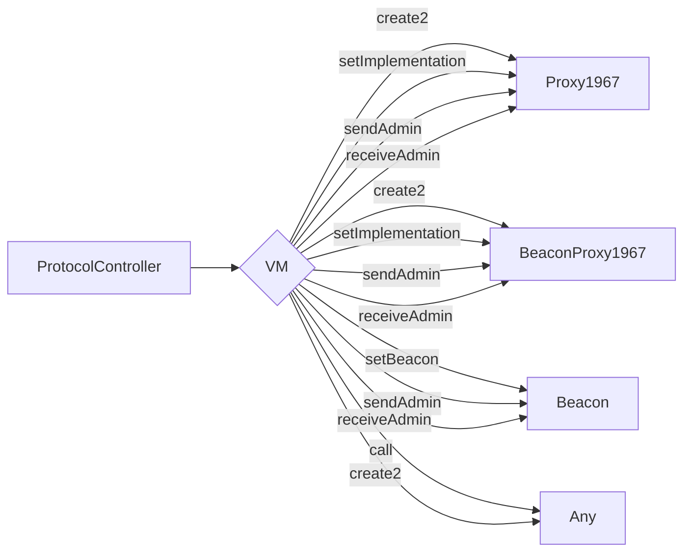
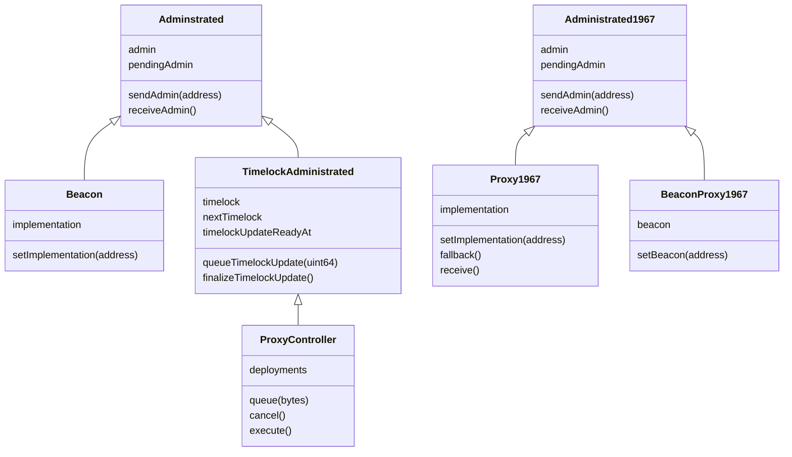

# Protocol Controller

The `protoctl` system enables complex smart contract deployment and upgrades with a publicly visible
timelock. Queued deployment data is stored for easy access in analyzing and auditing the deployment.

## Architecture

We employ a virtual machine whose intructions enshrine create and update operations for ERC-1967
beacons and proxies, administrator changes to target contracts, arbitrary external calls, and
arbitrary deterministic contract creations.

```solidity
enum Opcode {
    Halt,
    CreateProxy,
    CreateBeaconProxy,
    SetImplementation,
    SetBeacon,
    SendAdmin,
    ReceiveAdmin,
    Call,
    Create2
}
```



Each opcode comes with associated data tightly packed to their upper byte boundary. This is
functionally comparable to `abi.encodePacked`. The data associated with each is as follows.

```ebnf
operation ::=
    | (<halt>)
    | (<createProxy> . <salt>)
    | (<createBeaconProxy> . <salt>)
    | (<setImplementation> . <proxy> . <impl>)
    | (<setBeacon> . <proxy> . <beacon>)
    | (<sendAdmin> . <proxy> . <admin>)
    | (<receiveAdmin> . <proxy>)
    | (<call> . <target> . <value> . <payload>)
    | (<create2> . <salt> . <initcode>);

deployment ::= operation+
```

## Class Inheritance Tree

The `Administrated` inheritance tree uses the standard Solidity storage layout.

The `Administrated1967` inheritance tree uses the ERC-1967 compliant storage layout to avoid
storage collisions.



## TODO

- [ ] tests
- [ ] migrate to sstore2 for deployment storage
- [ ] shard large deployments between sstore2 operations
- [ ] documentation
